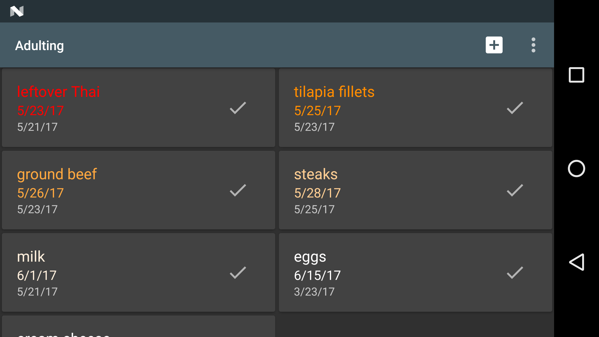
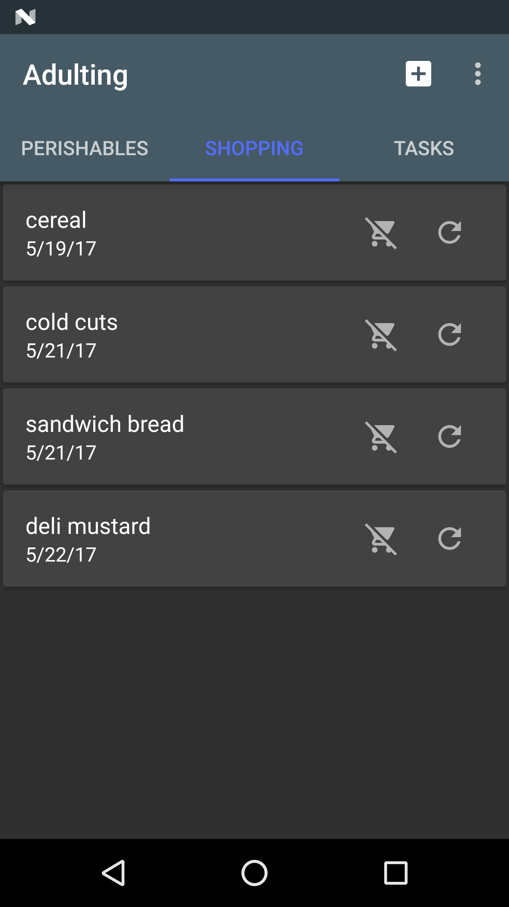
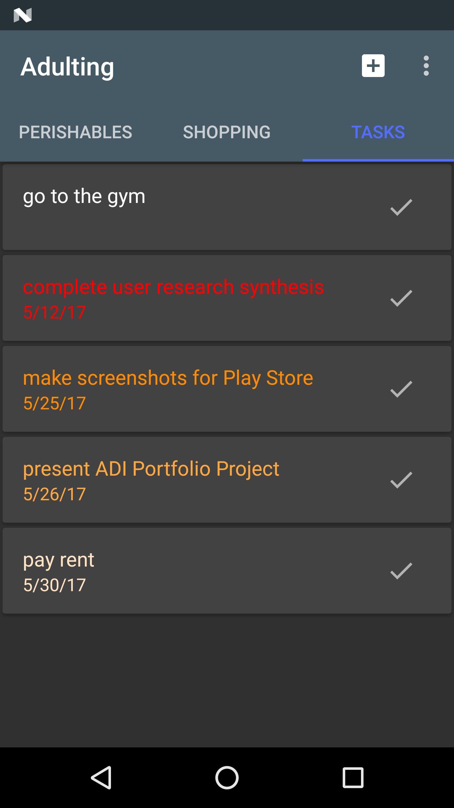

Adulting+
=====
### Final Project for ADI Oreo by Dave Parker

#### Google Play link: https://play.google.com/apps/testing/com.dave.adulting

Per the Google Play Store listing: After getting tired of having to throw out food that was too old, I decided to outsource remembering such things, and where better than the computer that lives in my pocket!

Features tracking for perishable goods you have, staples you need to buy, and general tasks, all synced to the cloud!

Currently in beta, with plenty of additional convenience features to come!

Technical features
-----
- Everything is automatically, continuously, and securely synced to the cloud using Google Firebase Database and Auth.
- All views implemented using lightweight Conductor controllers as an alternative to Fragments, including altering the number of columns in the child RecyclerView on the fly according to current screen width.
- Abstraction, abstraction everywhere! Code is aggressively abstracted to as to maximize reuse and minimize code duplication.

Perishables
-----

The original inspiration for the app, and with the most plans for future convenience features, the Perishables page allows the user to enter new perishables, with a description and an estimate of how long the item should last. Cards are sorted & highlighted by the calculated "best by" date, and when the user marks them complete the item is automatically added to the Shopping page, elaborated below.

Planned future features include adding items using the camera as a bar-code scanner, representing a perishable with a photo instead of or in addition to a description, adding items from a digital receipt, facilitating web lookup of how long an item should last, and autocompleting expected duration from previous entries and/or web database.

Shopping
-----

A shopping list is the natural counterpart to a list of perishable groceries! Items can be manually added in addition to being generated when a perishable item is marked complete, and are sorted by date added. Items can be removed entirely, or the user can add it back to the Perishable page with a new expected lifespan. In the future, the shopping list should have better management/blacklisting features.

Tasks
-----

For the rest of life's little obligations, there's a page to track tasks. Currently a generalized version of the Perishables list, tasks can be added with an arbitrary due-date via a date-picker. Future tasks will be able to specify how long they will take to complete, how important they are to complete, and whether they recurr, with a hybridized view to contextualize all of these.

Approach & Hurdles
-----
Unsurprisingly, the app came together much less promptly than originally expected/hoped, although the sources of the delays were somewhat incongruous. Although all I knew of the Conductor fragment-alternative library was a Android Meetup presentation, I had much less issue with the Controllers (think Fragment) and Routers (think Fragment Manager) than the conventional aspects of the ViewPager implementation. A lot of time was spent making sure that things were just so, from the copious abstraction, to the highlighting algorithm (ended up with exponential falloff with a .75 base coefficient, for any math nerds out there), to switching over the list items to common CardViews with individual contents inflated into ViewStubs therein.
